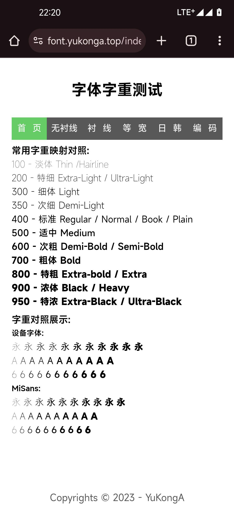

# MiSans字体 Magisk模块
>注:  无Normal字重 
>测试：PEP13运行正常

字体来源于[MiSans MIUI13全新系统字体](https://web.vip.miui.com/page/info/mio/mio/detail?postId=33935854)，使用[advanced-cjk-font-magisk-module-template](https://github.com/lxgw/advanced-cjk-font-magisk-module-template)制作。

由于模板只有9重字重，小米社区上释放的字体有10重字重，于是舍去Normal字重。

#### [模块下载链接](./magisk-model/MiSansNoNormalMagisk.zip) 

[字体字重测试](https://font.yukonga.top/index.html)

